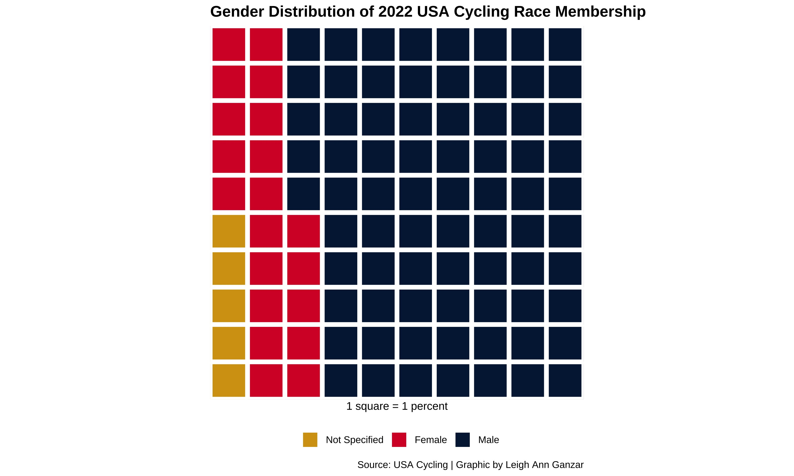

# 30DayChartChallenge
My contributions to 2022 #30DayChartChallenge.

# Categories
  1. Comparisons
  ## Day 1: Part to Whole
  
  [Code](30DayChartChallenge/Day 1/Day1_PartToWhole.R)
  ## Day 2: Pictogram
  
  [Code](Day 2/Day2_Pictogram.R)
  ## Day 3: Historical
  
  [Code](Day 3/Day3_Historical.R)
  ## Day 4: Flora
  
  [Code](Day 4/Day4_Flora.R)
  ## Day 5: Slope
  
  [Code](Day 5/Day5_Slope.R)
  3. Distributions
  4. Relationships
  5. Timeseries
  6. Uncertainties
