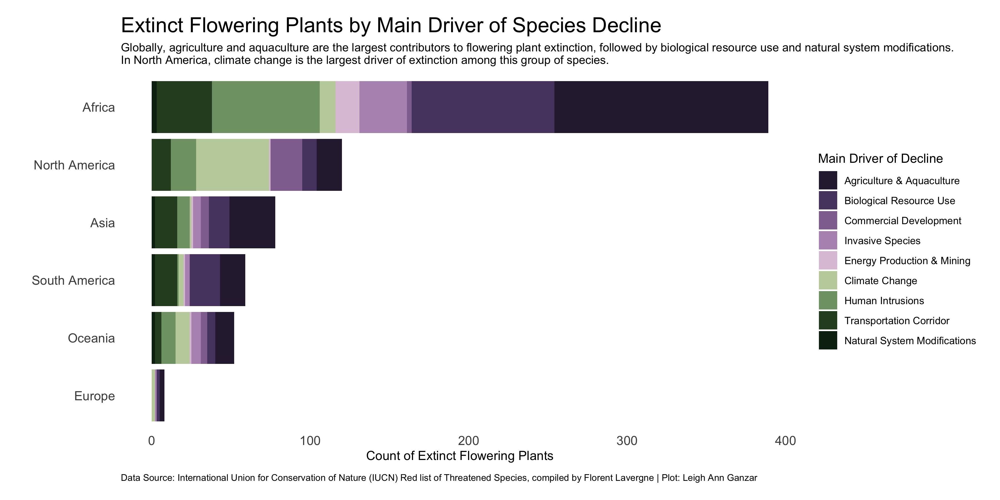

# 30DayChartChallenge
My contributions to 2022 #30DayChartChallenge.

# Categories
  1. Comparisons
  ## Day 1: Part to Whole
  <a href="https://github.com/LA-Ganzar/30DayChartChallenge/blob/957cf8194c82d21aa0c88174beba2369c3b3dc73/Day%201/plot.jpg">
  
[Code](https://github.com/LA-Ganzar/30DayChartChallenge/blob/main/Day%201/Day1_PartToWhole.R)
  
  ## Day 2: Pictogram
  <a href="https://github.com/LA-Ganzar/30DayChartChallenge/blob/f9cfd5f67639bd5cc8320a61e5a04523f794d3e4/Day%202/plot.jpg">
  
  [Code](https://github.com/LA-Ganzar/30DayChartChallenge/blob/main/Day%202/Day2_Pictogram.R)
  ## Day 3: Historical
  
  [Code](Day 3/Day3_Historical.R)
  ## Day 4: Flora
  
  [Code](Day 4/Day4_Flora.R)
  ## Day 5: Slope
  
  [Code](Day 5/Day5_Slope.R)
